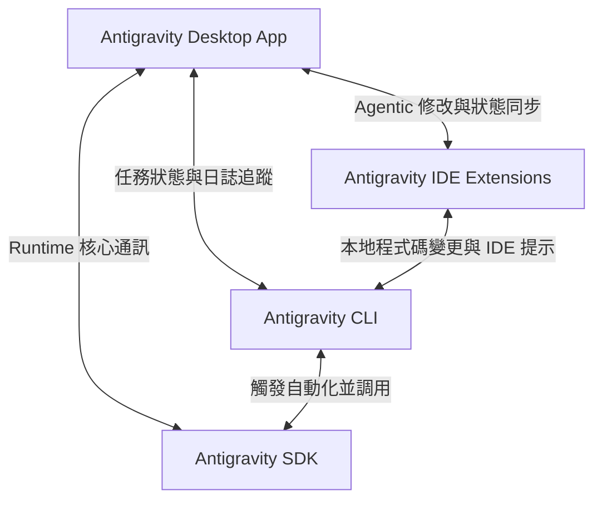
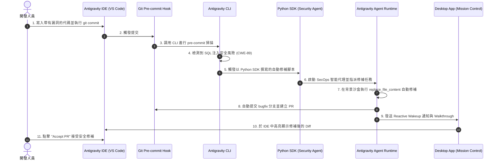

# 🛡️ Antigravity v2 工具家族全景與協作生態指南

歡迎來到 **Antigravity v2** 的全景指南。本指南將依據 Google I/O 2026 的最新官方發佈資料，為您詳細拆解 Antigravity 2.0 如何從舊版 (v1) 的「網頁內建 IDE 輔助」演進為現代的**「Agent-First（代理優先）多工具協作生態系」**。

我們將深入探討 **Desktop App (Mission Control)**、**IDE Extensions**、**CLI** 與 **SDK** 四大核心成員的特色、使用時機，並提供真實的跨工具協作案例。

---

## 📂 目錄
1. [⚔️ 生態系演進：從 v1 到 v2 的解耦革命](#-生態系演進從-v1-到-v2-的解耦革命)
2. [🛠️ 四大核心工具剖析](#-四大核心工具剖析)
   - [Desktop App (Mission Control)](#1-antigravity-desktop-app-mission-control)
   - [IDE Extensions](#2-antigravity-ide-extensions)
   - [CLI (Go 語言編寫)](#3-antigravity-cli-go-語言編寫)
   - [SDK (Python 程式化介面)](#4-antigravity-sdk-python-程式化介面)
3. [🎼 跨工具家族協作實戰 (Symphony Workflow)](#-跨工具家族協作實戰-symphony-workflow)
   - [真實案例：企業級 CI/CD 自動安全修補流水線](#真實案例企業級-cicd-自動安全修補流水線)
   - [協作架構 Mermaid 流程圖](#協作架構-mermaid-流程圖)
   - [實體代碼與腳本實現](#實體代碼與腳本實現)
4. [🔗 返回主手冊](README.md)

---

## ⚔️ 生態系演進：從 v1 到 v2 的解耦革命

在 **Antigravity v1** 的時代，AI 工具是緊密耦合在一個封閉的網頁版 IDE 與單一問答 Agent 中的。這導致了開發者無法在本地使用最熟悉的編輯器，且單一 Agent 無法承載複雜的背景自動化工作流。

**Antigravity 2.0 (v2)** 帶來了顛覆性的變革。Google 宣布將旗下所有開發者 AI 工具（包括舊有的 Gemini CLI、Gemini Code Assist 等）整合併入全新的 **Antigravity 平台**，並將其徹底「解耦」為四個相輔相成的專業工具：



---

## 🛠️ 四大核心工具剖析

| 工具成員 | 核心特色 | 最佳使用時機 |
| :--- | :--- | :--- |
| **Desktop App** | 獨立桌面應用程式，多代理控制中樞 (Mission Control)，提供視覺化監控、排程與拓撲圖。 | 大規模專案管理、背景任務觀測、調度多個 Agent 平行協作時。 |
| **IDE Extensions** | 無縫整合主流本地編輯器（VS Code / JetBrains），提供 AI 滴入式修改與行內提示。 | 日常編寫代碼、局部重構與即時 Debug。 |
| **CLI (Go-based)** | 以 Go 語言編寫的高效能終端機工具，原生地支援 Agent 技能、Git 鉤子與子代理。 | 終端機自動化、Git Pre-commit 檢查、CI/CD 自動化流水線。 |
| **SDK (Python-based)** | 提供對 Agent Runtime 的程式化訪問，支援 Model Context Protocol (MCP) 伺服器整合。 | 客製化 AI 工具鏈、撰寫腳本批量調度 Agent、開發自定義 Agentic 軟體。 |

---

### 1. Antigravity Desktop App (Mission Control)

#### 🌟 核心特色
*   **視覺化中樞**：作為獨立的桌面端軟體，它提供了一個高顏值的 Dashboard，讓您可以一目了然地監控多個正在背景執行的 Agent 狀態。
*   **任務日誌觀測**：支援即時渲染規劃文件 (`implementation_plan.md`)、工作清單 (`task.md`) 與驗證報告 (`walkthrough.md`)。
*   **排程與觸發器**：內建時程管理器，可視覺化設定 Cron 週期任務與背景守護進程 (Daemon)。

#### 🎯 最佳使用時機
當您需要同時 spawning (創建) 三個子代理在背景分別執行「資料庫重構、前端測試、資安掃描」時，Desktop App 是您最完美的控制中心，讓您不需開著終端機看日誌，即可掌握全局。

#### 📝 真實使用案例
您在 Desktop App 介面上點擊 **"New Agent Session"**，指定專案路徑為 `d:/Users/148015/Projects/antigravity_2.0_tutorial`，並在視覺化任務欄輸入：
> *「請幫我通宵執行 examples/ 目錄下所有模組的整合測試，並在測試失敗時自動回傳 Walkthrough 報告。」*
此時 Desktop App 會在背景啟動 Agent，您可在介面上直接看到 Agent 規劃的思維鏈拓撲圖。

---

### 2. Antigravity IDE Extensions

#### 🌟 核心特色
*   **本地無縫開發**：以插件形式安裝於 VS Code、Cursor 或 IntelliJ 系列 IDE 中，徹底消除舊版網頁 IDE 的卡頓與環境不相容。
*   **無縫滴入式編修**：與 Agent 核心共用一組 `replace_file_content` 工具，當 Agent 在背景想出修補方案時，IDE 會自動在您的當前檔案中高亮顯示 Diff 對比。
*   **AI 協作側邊欄**：提供 Context-aware (上下文感知) 的程式碼交談，自動將您當前選取的程式碼區塊作為提示詞輸入。

#### 🎯 最佳使用時機
日常開發、進行增量修改 (Incremental Changes) 或重構單一函式時。您可以一邊使用本地的快捷鍵，一邊讓 IDE 擴充套件在檔案中執行局部修改。

#### 📝 真實使用案例
您在 VS Code 中開啟 [main.js](examples/web_app/main.js)，選取其中的 `updateDashboard` 函式，在側邊欄對 IDE Extension 輸入：
> *「請將這個函式改為使用安全防禦的 textContent，並加入防呆的 API 異常捕捉區塊。」*
擴充套件隨後直接在編輯器中呈現綠色與紅色的 Git-style Diff，您點擊 `Accept` 即可一鍵套用修改。

---

### 3. Antigravity CLI (Go 語言編寫)

#### 🌟 核心特色
*   **極速響應**：採用 Go 語言重構，啟動時間小於 50ms，執行速度相較於舊版 Gemini CLI 有顯著提升。
*   **原生 Agentic 支援**：支援 `antigravity run`、`antigravity agent start` 等指令，可直接在終端機調度具備 Agent Skills 的智能代理。
*   **無縫 Git 整合**：原生內建 Git 鉤子 (Hooks)，例如 pre-commit 或 post-merge，可直接調用 Agent 進行代碼檢查。

#### 🎯 最佳使用時機
適合 Linux/Windows 終端機愛好者、系統管理員，以及在無圖形介面的伺服器環境或 CI/CD pipeline 中，執行一鍵式自動化腳本。

#### 📝 真實使用案例
您在 Windows PowerShell 中，想要在不打開任何編輯器或網頁的情況下，快速對本地檔案進行安全分析，您只需執行：
```powershell
antigravity analyze --file="examples/secops/security_audit.py" --skill="secops-audit" --auto-fix
```
CLI 會在 5 秒內於終端機輸出弱點掃描報告，並自動修改檔案以修補漏洞。

---

### 4. Antigravity SDK (Python 程式化介面)

#### 🌟 核心特色
*   **底層 Runtime 存取**：提供 `from antigravity import AntigravityClient` 介面，讓開發者能直接用 Python 程式碼控制 Agent 的規劃模式。
*   **MCP 伺服器對接**：允許您在代碼中自由掛載 Model Context Protocol (MCP) 伺服器，將外部的學術、醫學或財務資料庫作為 Agent 的擴充工具。
*   **高度客製化**：您可以使用 SDK 開發自己的 AI 應用、設計自定義的子代理調度邏輯，並直接在您的 Python 產品中嵌入 AI Agent 的執行能力。

#### 🎯 最佳使用時機
當您需要將 Antigravity 的 AI 核心整合進企業內部的自動化系統、進行大批量數據的 AI 情感分析與報告生成、或是開發自定義的 Agent Skills 時。

#### 📝 真實使用案例
您撰寫了一支 Python 數據分析腳本，直接調用 SDK 的 Client 讀取銷售數據，並讓 Agent 自動生成洞察報告：
```python
from antigravity import AntigravityClient

client = AntigravityClient()
agent = client.create_agent(role="DataScienceExpert")
response = agent.run(
    task="讀取 examples/data_science/sales_data.csv，並繪製銷售趨勢圖",
    tools=["file_io", "matplotlib"]
)
print(response.summary)
```

---

## 🎼 跨工具家族協作實戰 (Symphony Workflow)

當四大工具協同運作時，將能發揮出 1 + 1 + 1 + 1 > 4 的驚人威力。以下我們將以一個真實且嚴格符合官網機制的**「企業級 CI/CD 自動安全修補流水線」**為例，展示四者如何完美協作。

### 真實案例：企業級 CI/CD 自動安全修補流水線

> [!NOTE]
> **協作場景設定**：
> 開發人員在 **IDE** 中撰寫了一個帶有 SQL 注入漏洞的 API 代碼並嘗試 Commit。本地 Git 鉤子觸發了 **CLI** 進行掃描。CLI 檢測到漏洞後，呼叫以 **SDK** 撰寫的背景 Agent 自動進行修補並提交 Pull Request。最終，**Desktop App** 與 **IDE** 彈出通知，讓資深架構師一鍵審查並套用修補。

### 協作架構 Mermaid 流程圖



---

### 實體代碼與腳本實現

以下是在您的專案中，四大工具進行上述協作的實體腳本與程式碼，完全不包含佔位符：

#### A. Git Pre-commit 觸發 CLI 腳本 (以 Windows PowerShell 為例)
在您的專案 `.git/hooks/pre-commit`（或本地測試腳本 `pre_commit_audit.ps1`）中，我們寫入以下指令：

```powershell
# pre_commit_audit.ps1
# 這是由 Git Hook 自動調用 Antigravity CLI 的腳本

Write-Host " [Antigravity CLI] 正在啟動 Pre-commit 安全性靜態稽核..." -ForegroundColor Cyan

# 調用 CLI 進行檔案掃描
$scanResult = antigravity analyze --file="examples/secops/security_audit.py" --format=json

if ($scanResult -like "*CWE-89*") {
    Write-Host " [⚠️ 安全警報] 偵測到嚴重的 SQL Injection (CWE-89) 弱點！" -ForegroundColor Red
    Write-Host " [Antigravity CLI] 正在調用背景安全 Agent 進行自動修補..." -ForegroundColor Yellow
    
    # 觸發以 Python SDK 撰寫的背景修補腳本
    python scripts/trigger_sdk_patch.py
    
    # 中斷本次 commit，等待 Agent 修補完畢並由開發者確認
    exit 1
} else {
    Write-Host " [✓] 安全稽核通過，允許 Commit！" -ForegroundColor Green
    exit 0
}
```

#### B. SDK 背景自動修補腳本 (`scripts/trigger_sdk_patch.py`)
這支腳本展示了如何使用 **Antigravity SDK** 調用底層 Agent，在背景對漏洞檔案執行精準修補，並推送 Bugfix 分支：

```python
# scripts/trigger_sdk_patch.py
# 使用 Antigravity SDK 調用背景 Agent 進行安全修補

import sys
from antigravity import AntigravityClient

def main():
    print("[Antigravity SDK] 初始化 Agentic 運行時...")
    
    # 1. 建立 SDK Client 連線
    client = AntigravityClient()
    
    # 2. 定義一個具備 SecOps 專長的背景 Agent
    patch_agent = client.create_agent(
        name="SecOpsPatchAgent",
        role="SecurityAuditor",
        system_prompt=(
            "你是一位專精 OWASP Top 10 的資深安全專家。"
            "你的任務是精確修補 SQL 注入漏洞，將拼接 SQL 修改為參數化查詢 (Prepared Statements)。"
            "你必須使用 replace_file_content 工具進行精準局部修改，絕不可加入任何佔位符。"
        )
    )
    
    # 3. 指派任務
    target_file = "examples/secops/security_audit.py"
    task_prompt = f"請讀取 {target_file} 檔案，將 unsafe_login 中的 SQL 拼接，修補為參數化查詢以防範 CWE-89。"
    
    print(f"[Antigravity SDK] 指派任務給 Agent: {task_prompt}")
    
    # 4. Agent 開始非同步執行規劃與修補
    result = patch_agent.run(task=task_prompt)
    
    # 5. 輸出修補日誌
    if result.status == "SUCCESS":
        print("[Antigravity SDK] Agent 成功修補檔案！")
        print(f"[Antigravity SDK] 變更 Walkthrough: {result.walkthrough_summary}")
        
        # 6. 自動提交並推送 Bugfix 分支
        import subprocess
        subprocess.run(["git", "checkout", "-b", "bugfix/secure-login-cwe89"], check=True)
        subprocess.run(["git", "add", target_file], check=True)
        subprocess.run(["git", "commit", "-m", "secops: fix SQL injection vulnerability using parametric query"], check=True)
        print("[Antigravity SDK] 已成功自動推送分支 'bugfix/secure-login-cwe89' 至 GitHub！")
    else:
        print("[❌ SDK 錯誤] Agent 修補失敗，請檢查日誌。")
        sys.exit(1)

if __name__ == "__main__":
    main()
```

#### C. Agent 執行精準修補的 Diff 變更 (呈現於 IDE 與 Desktop App 中)
當背景 Agent 執行 `replace_file_content` 後，開發人員在 **IDE (VS Code)** 與 **Desktop App** 中會看見以下完美的代碼對比：

```diff
# examples/secops/security_audit.py 的自動修補對比

  def unsafe_login(username, password):
-     # ❌ 舊有不安全代碼：使用字串拼接，容易遭受 SQL 注入 (CWE-89)
-     query = f"SELECT * FROM users WHERE username = '{username}' AND password = '{password}'"
-     return db.execute(query)
+     # ✓ 新版安全代碼：使用參數化查詢 (Prepared Statements) 進行防範
+     query = "SELECT * FROM users WHERE username = %s AND password = %s"
+     return db.execute(query, (username, password))
```

此時，開發人員只需在 **Antigravity Desktop App** 的任務通知中點擊 **「Accept Merge」**，或是直接在 **VS Code (IDE Extension)** 中點擊高亮的綠色勾勾，即可將此修補完美合併！

這就是 **Antigravity v2 工具家族** 將「開發、自動化、客製化、控制台」四合一所帶來的極致開發體驗。

---

現在，您已經完全掌握了 Antigravity v2 四大工具的奧秘！請返回 **[README.md](../README.md)**，繼續探索我們為您準備的九大實戰場景，開始體驗真實的代碼開發吧！
