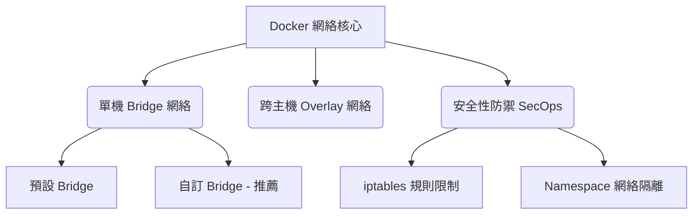

# 📝 知識金字塔：Docker 網絡架構與安全防禦學霸筆記

本文件旨在作為 **Antigravity v2 「學霸導師模式」** 的標準筆記範本。當您下達指令要求 Agent 進行知識萃取或撰寫筆記時，Agent 將會嚴格遵循本結構，結合高質感的富文本元素，協助您秒懂複雜的技術概念。

---

## 🧭 導覽地圖



---

## 🎯 核心觀念解構

> [!NOTE]
> **什麼是 Docker 網絡空間？**
> Docker 透過 Linux 的 **Network Namespace** 技術，實現了容器間網絡的完全獨立隔離。每個容器都擁有自己專屬的虛擬網卡（veth pair）與路由表。

### 1. 單機橋接網絡 (Bridge Network)
*   **預設橋接 (`bridge`)**：容器啟動時預設加入的網絡，不支援透過「容器名稱」進行自動 DNS 解析，只能使用 IP 連線。
*   **自訂橋接 (User-Defined Bridge)**：
    *   **👍 推薦理由**：內建自動 DNS 解析（直接使用 `ping container_name` 即可連線），且具備更好的安全隔離性。

### 2. 跨主機覆蓋網絡 (Overlay Network)
*   適用於 Docker Swarm 或多主機叢集，利用 VXLAN 技術在底層物理網絡之上建立一個邏輯的虛擬二層網絡，實現容器間的跨實體主機通訊。

---

## ⚔️ 安全防禦黃金法則 (SecOps Perspective)

> [!WARNING]
> **Docker 預設會繞過 UFW/Firewalld 防火牆！**
> Docker 會直接修改主機的 `iptables` 規則。這意味著即使您在 Linux 上關閉了某個端口，Docker Container 依然可能直接向外網暴露！

### 🛡 安全防護三部曲：
1.  **禁止容器間相互偵測 (ICC = False)**：
    在 `/etc/docker/daemon.json` 中設定 `"icc": false`，防止同一橋接網絡下的其他容器遭受內網橫向攻擊 (Lateral Movement)。
2.  **綁定本機端點 (Local Binding)**：
    發布端口時，永遠使用 `127.0.0.1:8080:80`，避免直接綁定到 `0.0.0.0` 暴露給公網。
3.  **啟用唯讀根目錄 (`--read-only`)**：
    防止攻擊者攻破容器後修改網絡設定或植入後門。

---

## 🎡 投影片核心導讀 (Carousel Presentation)

以下為本章重點的 Carousel 結構，您可以使用 IDE 輪播檢視：

````carousel
### 🧊 Slide 1: 預設橋接網絡的致命傷
* 無法以容器名稱進行 DNS 解析。
* 容易造成容器間未隔離的橫向滲透。
* 所有容器共享同一個 `docker0` 網橋，缺乏安全邊界。

<!-- slide -->

### 🚀 Slide 2: 自訂橋接網絡的最佳實踐
```bash
# 建立一個安全的專屬網絡
docker network create --driver bridge secure_app_net

# 將容器加入此安全網絡
docker run -d --name db --network secure_app_net mariadb
docker run -d --name web --network secure_app_net nginx
```
* 自動支援 DNS 解析。
* 實現物理與邏輯上的網絡沙盒隔離！

<!-- slide -->

### 🛡 Slide 3: Docker-Compose 安全宣告範本
```yaml
version: '3.8'
services:
  web:
    image: wordpress:latest
    networks:
      - frontend
  db:
    image: mysql:latest
    networks:
      - backend
networks:
  frontend:
  backend:
```
* 前端 `web` 無法直接存取資料庫主機，只能透過邏輯網絡防護，實踐最小特權原則！
````

---

## ❓ 學霸常見問答錄 (Q&A)

### Q1：如何快速排查容器網路不通的問題？
*   **導師解答**：
    1.  先使用 `docker inspect <container_id>` 查看該容器被分配在哪個 `Network`，確保兩者在同一個網絡下。
    2.  利用 `docker exec -it <container_id> ping <target_name>` 檢查 DNS 解析是否正常。
    3.  查看宿主機的 `iptables -L -n -t nat` 規則，確認端口映射是否被成功載入。

---

## 🧠 延伸思考與課後練習
1.  *思考題*：若容器遭受拒絕服務攻擊 (DoS)，如何利用 Docker 的 `--network none` 將其緊急隔離，同時保留其內存狀態以便進行鑑識分析？
2.  *實作題*：請在本地嘗試撰寫一個 Dockerfile，將其網絡功能限縮，僅允許對特定外部 API 的 Outbound 連線。
